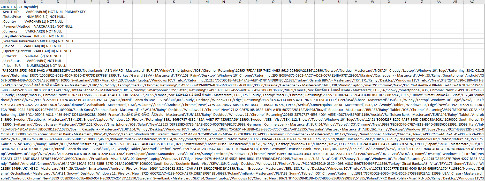
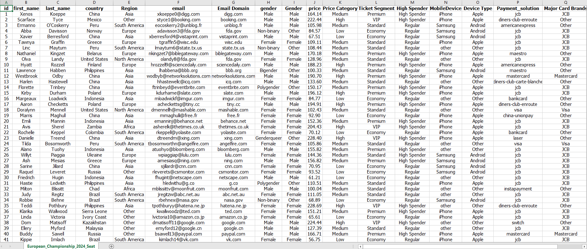
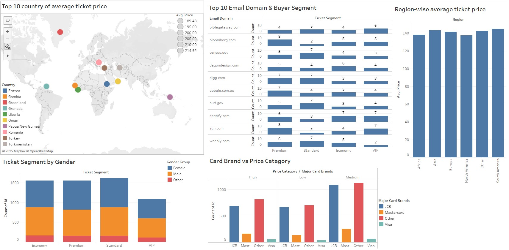
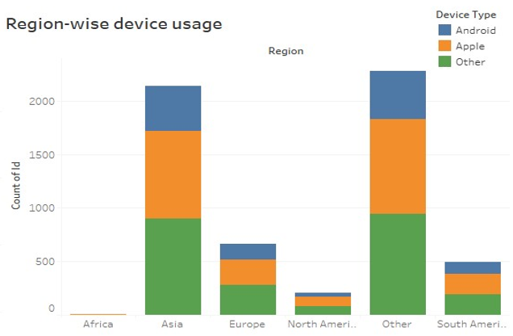
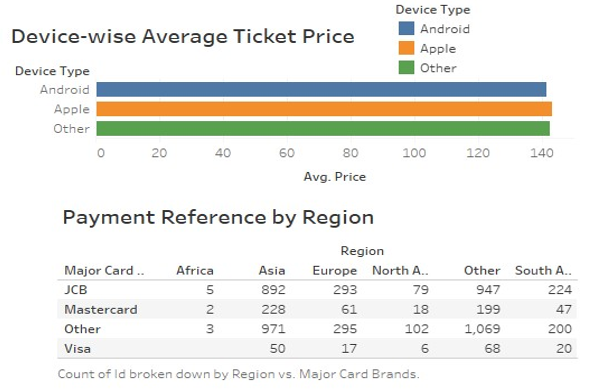
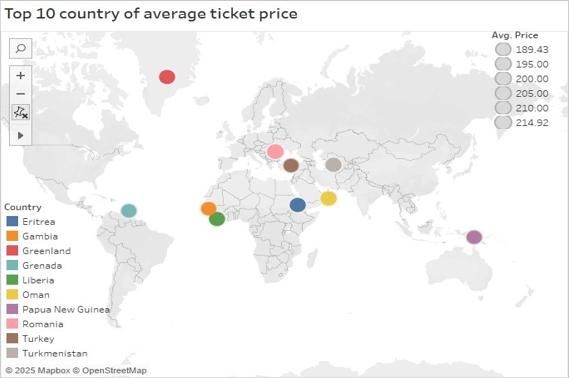
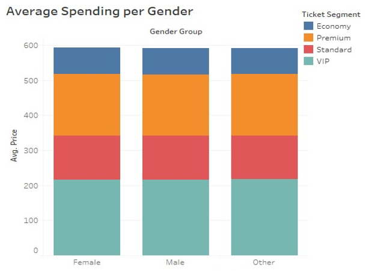

# 🏟️ Euro Championship Seat Category Visualization


---

## 📊 Project Overview
This project focuses on analyzing **seat category pricing and customer behavior**
during **European Championship football events**.  
Using **cleaned Excel data** and **Tableau dashboards**, the project derives
actionable insights related to **pricing strategy, customer segmentation, and revenue optimization**.

The repository demonstrates a **complete analytics workflow**, from raw data to
visual storytelling and business recommendations.

---

## 🎓 Academic Context

- **University:** South Westphalia University of Applied Sciences (Germany)
- **Course:** Data Science Project Seminar Driving Corporate Performance
- **Project Type:** Academic Data Analytics Project
- **Semester:** Summer Semester 2025
- **Domain:** Sports Analytics & Business Intelligence

---

## 📊 Dataset Description

- **Source:** University-provided dataset
- **Format:** Raw data > Excel
- **Data Stages:**
  - Raw dataset (original data)

  - Processed dataset (cleaned & transformed)


### Key Variables:
- Seat Category
- Ticket Price
- Country & Region
- Device Type
- Gender

---

## 🎯 Objectives
- Analyze seating distribution across championship venues
- Visualize seat category pricing and occupancy rates
- Generate insights for revenue optimization
- Create interactive dashboards for stakeholder presentation

## 📁 Project Structure
```bash  
Euro-Championship-Seat-Category-Visualization/ 
├── README.md 
├── data/ 
│ ├── raw/    # Original datasets
│ │ └── euro_seat_data_raw.xlsx 
│ └── processed/    # Cleaned data files 
│ └── euro_seat_data_processed.xlsx 
├── tableau/     # Tableau workbooks & dashboards
│ └── exports/ 
│ └── images/  
├── presentations/    # presentations
│ └── Euro_Championship_Seat_Analysis.pptx 
├── analysis/     # Analysis reports 
│ ├── insights_report.md 
│ └── methodology.md 
└── docs/    # Documentation
  └── project_overview.md
``` 
---  

## 🔄 Data Analytics Workflow
```text
Raw Excel Data
      >
Data Cleaning & Preprocessing
      >
Processed Dataset
      >
Tableau Visualizations
      >
Insights & Business Recommendations  
``` 
---

## 📊 Dashboard Overview  
  


---

## 🏆 Key Insights
- **Most Profitable Categories:** VIP and Premium seating
- **Optimal Pricing:** Price-occupancy correlation analysis
- **Venue Comparison:** Capacity utilization across locations
- **Revenue Opportunities:** Underserved seating categories


### Tools Used:
- **Microsoft Excel** – data cleaning & preprocessing  
- **Tableau Desktop** – visual analytics & dashboards  
- **GitHub Markdown** – documentation & reporting  

---

## ❓ Key Business Questions

1. How does ticket pricing vary across regions and countries?
2. Which seat categories contribute most to revenue?
3. How does device type influence purchasing behavior?
4. Are there observable gender-based spending patterns?
5. What insights can support future event pricing strategies?

---

## 📈 Visualization Gallery

All dashboards were created using **Tableau** and exported for documentation.

### 🌍 Region-wise Average Ticket Price


**Insight:**  
Significant pricing variation exists between regions, with Western regions
showing higher average ticket prices.

---

### 💻 Device-wise Average Ticket Price


**Insight:**  
Desktop users tend to purchase higher-priced tickets,
while mobile users dominate volume at lower average prices.

---

### 🌐 Country-wise Average Ticket Price


**Insight:**  
Host countries and football-dominant nations exhibit premium pricing patterns.

---

### 👥 Gender-wise Average Spending


**Insight:**  
Male customers show slightly higher average spending,
while female customers demonstrate stable purchasing behavior.

---

## 🧠 Key Insights Summary

- Ticket prices vary significantly by region and country
- Device type strongly influences purchasing behavior
- Host countries command premium pricing
- Gender-based spending differences are present but moderate
- Data-driven pricing strategies can improve revenue outcomes

📄 Detailed analysis:  
➡️ [`analysis/insights_report.md`](analysis/insights_report.md)

---

## 💼 Business Recommendations

- Apply **region-based pricing strategies**
- Optimize **seat category allocation per venue**
- Design **mobile-focused offers** for price-sensitive segments
- Use demographic insights for **targeted promotions**

---

## 📁 Repository Structure & Artifacts

| Component | Description |
|--------|------------|
| 📊 Data | Raw & processed Excel datasets |
| 📈 Visuals | Tableau dashboard exports |
| 🧠 Analysis | Insights & methodology |
| 🎤 Presentation | Final academic presentation |

📌 Quick Links:
- 📊 [Raw Data](data/raw/)
- 🧹 [Processed Data](data/processed/)
- 📉 [Tableau Visualizations](tableau/exports/)
- 📄 [Methodology](analysis/methodology.md)
- 📊 [Insights Report](analysis/insights_report.md)
- 🎤 [Final Presentation](presentation)

---

## 🛠️ Skills Demonstrated

- Data Cleaning & Preparation
- Tableau Dashboard Development
- Sports Analytics
- Business Intelligence
- Data Storytelling
- Analytical Thinking
- Professional Documentation

---

## 📌 Disclaimer

This project was developed **strictly for academic purposes**.
The dataset and analysis are intended for educational demonstration only.

## ✉️ Contact

💼 LinkedIn: https://www.linkedin.com/in/md-abdullah-al-noman-333aa4155  
📁 GitHub: https://github.com/nomanmridha

---

